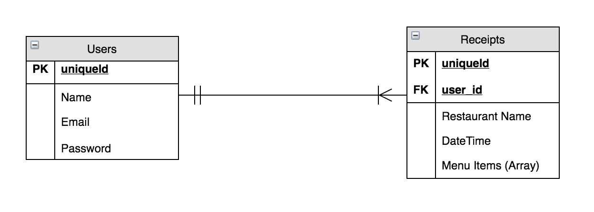
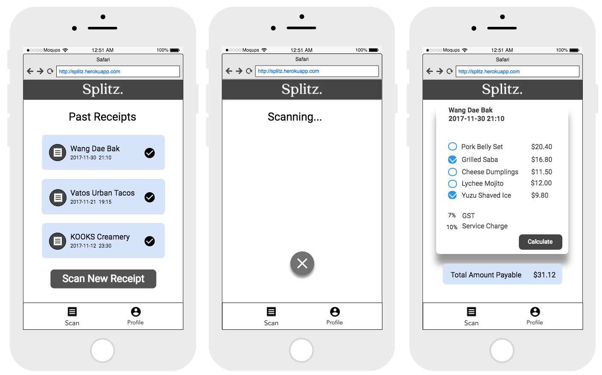
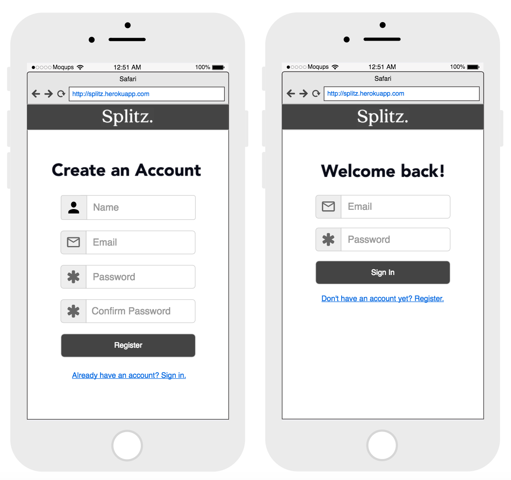
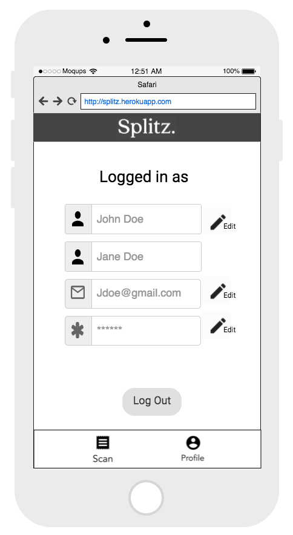

# Splitzz
##### PROJECT 4

 [Live Link (Heroku)](https://splitz.herokuapp.com/)

## Group Members
* [Zheng Yu (GitHub)](https://github.com/koozy0)
* [Li Yuan (GitHub)](https://github.com/liyuan23)

## Description
Scan any receipt to split bills with friends easily!
_____
## <center>Installation instructions

``` bash
# install dependencies
npm install

# serve with hot reload at localhost:8080
npm run dev

# build for production with minification
npm run build

# build for production and view the bundle analyzer report
npm run build --report
```

## ERD


## Wireframes

### Scan Receipts Pages


### Register/Login Pages


### Edit Profile Page


## <center> User Stories

1. As a user, I can scan multiple receipts for different restaurant
3. As a user, I can calculate how much is my portion of the bill
___

## Assumptions
* GST and service charge is not included in prices of menu items

## <center> To Do List
**COMPLETED**  | Importance | Type
-------- | --- | ---  
~~Add OCR API to allow users to split the bill~~ | **HIGH** | Framework
~~Add Camera API to take photo of receipt~~ | **HIGH** | Framework
~~Update README with latest erd, wireframe images and user stories~~ | Low | Framework
~~Add materialize for vue~~ | **HIGH** | Framework
~~Add components for pages~~ | **HIGH** | Framework
~~Add routes for pages~~ | **HIGH** | Framework
~~Split the results from OCR API to accurately display the menu items in the bill~~ | **HIGH** | Framework
~~Come up with function to accurately sum total from checked menu items to accurately display the amount payable~~ | **HIGH** | Framework


## Potential Improvements
* Retrieve restaurant name and datetime data and display accurately
* View previously scanned receipts
* Groups to share bills
